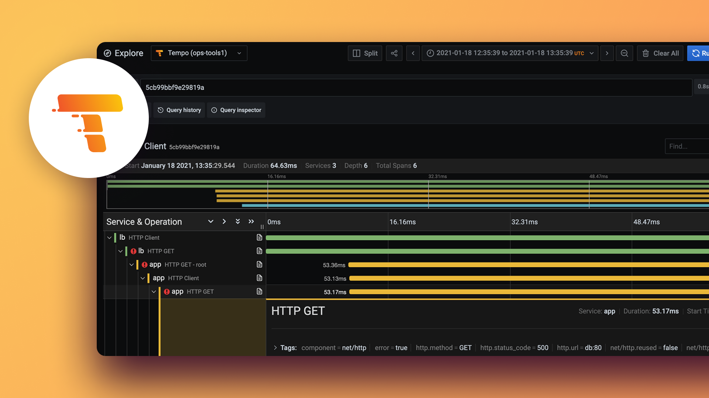
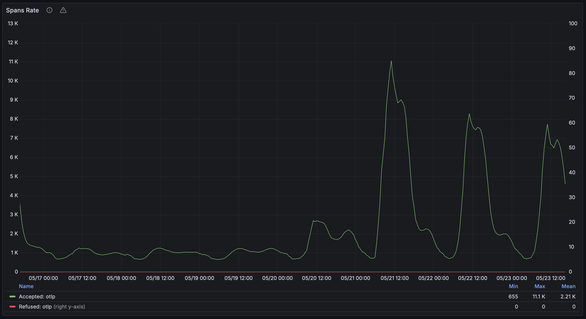

This is the story of how we adopted [OpenTelemetry][otel] at the Norwegian Labour and Welfare Administration (NAV). We will cover the journey from the first steps to the first traces in production. We will also share some of the challenges we faced and how we overcame them.

[otel]: https://opentelemetry.io/

At NAV, we have a microservices architecture with thousands of services running in our Kubernetes clusters. We have been teaching our teams to adopt Prometheus metrics and Grafana, but to a large degree they still rely on digging through application log using Elastic and Kibana.

Without proper request tracing, it is hard to get a good overview of how requests flow through the system. This makes it hard to troubleshoot errors in complex value chains and optimize slow requests. It is like trying to navigate a city without a map.

There has been several attempts to shoehorn some form of request tracing using HTTP headers over the years. I have found `Nav-Callid`, `nav-call-id`, `callId`, `X-Correlation-ID`, `x_correlationId`, `correlationId`, `x_correlation-id`, and even `x_korrelasjonsId` (Norwegian for correlationId). There are probably more variations out there that I haven't found yet.


It seams we are stuck in an endless loop of trying to get everyone to agree on a standard, and then trying to get everyone to implement it correctly. This is where OpenTelemetry comes in. It provides a standard way to define telemetry data from your applications, and it provides libraries for most programming languages to make it easy to implement.

## The first steps

Even though OpenTelemetry does a lot of the heavy lifting for you, it is still a complex system with many moving parts. Did you know that OpenTelemetry is the fastest growing project in the Cloud Native Computing Foundation (CNCF)? It has an even steeper adoption curve than Kubernetes had in the early days!

In order to get started with OpenTelemetry, you need two things:

1. A place to store (and visualize) the telemetry data
1. Convincing your developers that it is worth their time to instrument their applications

Doesn't sound too hard, right? Let's start with the storage backend.

OpenTelemetry is a vendor-neutral project, so you can choose any storage backend you like. The most popular choices are Jaeger, Zipkin, and Tempo. We chose [Grafana Tempo][grafana-tempo] because it is a scalable, cost-effective, and open source solution that integrates seamlessly with Grafana that we already use for metrics and dashboards.

[grafana-tempo]: https://grafana.com/oss/tempo/


We have written extensively about how to get started with Grafana Tempo in our [documentation][nav-tempo] as well as a reference guide for the query language used in Tempo called [TraceQL][nav-traceql].

You can send OpenTelemetry data directly to Tempo, but the recommended way is to use an [OpenTelemetry Collector][otel-collector]. The Collector can receive data from multiple sources, process it, and send it to multiple destinations. This makes it easy to add new sources or destinations without changing your application configuration.

Installing things like this in a Kubernetes cluster is something the NAIS team have done for the better part of ten years, so we had no problem setting up the Collector and connecting it to Tempo in our clusters, we run one Tempo instance for each environment (dev and prod) accessible from a global Grafana instance.

The hard part was getting the developers to instrument their applications...

[nav-traceql]: https://doc.nais.io/reference/observability/tracing/traceql/
[nav-tempo]: https://docs.nais.io/how-to-guides/observability/tracing/tempo/
[otel-collector]: https://opentelemetry.io/docs/collector/

## Instrumenting the applications

From the very beginning, we knew that the key to success was to make the developers understand the value and benefit of good observability and make it as easy as possible for the developers to instrument their applications. With over 1.600 applications in production, we couldn't afford to spend weeks or months on each one. A solution that *required* manual configuration for each application was a non-starter.

With most of our backend services written in Kotlin and Java, we started by testing the [OpenTelemetry Java Agent][otel-java-agent]. A java agent is a small piece of software that runs alongside your application and can modify the bytecode as it is loaded into the JVM. This allows it to automatically instrument your application without any changes to the source code.

To our pleasant surprise, the agent worked out of the box with most of our applications. It was able to correctly correlate incoming and outgoing requests, understand the different frameworks we use, and even capture database queries and async calls to message queues like Kafka. In fact the OpenTelemetry Java agent supports over 100 different libraries and frameworks out of the box!

Previously we have been able to install such agents in the node, but with the move to Kubernetes, we had to find a way to get the agent onto the container as there are no shared jvm runtime. In the past we have made pre-built Docker images with the agent installed, but this had a high maintenance cost as we had to keep the images up to date with the latest version of the agent across different base images and major versions.

This is where the [OpenTelemetry Operator][otel-operator] comes in. The Operator is a Kubernetes operator that can automatically inject the OpenTelemetry Java Agent (and agents for other programming languages) directly into your application pods. It can also configure the agent to send data to the correct Collector and set up the correct service name and environment for each application since it has access to the Kubernetes API.

[otel-java-agent]: https://opentelemetry.io/docs/languages/java/automatic/
[otel-operator]: https://opentelemetry.io/docs/operator/

## Putting it all together

In case you are new to NAV, we have a open source application platform called [nais][nais] that provides everything our application teams need to develop, run and operate their applications. It's main component is [naiserator][naiserator] (a Kubernetes Operator) and the [`nais.yaml`][nais-manifest] that defines how an application should run in our Kubernetes clusters.

It looks something like this:

```yaml
apiVersion: "nais.io/v1alpha1"
kind: "Application"
metadata:
  name: "my-application"
  namespace: "my-team"
spec:
  image: "navikt/my-application:abc123"
  replicas: 2
  ...
```

This is a very powerful abstraction that have allowed us to add new features to the platform with as little effort on the developer's part as possible. We added a new field to `nais.yaml` called `observability` that allows the developers to enable tracing for their applications with a single line of code:

```yaml
...
  observability:
    autoInstrument:
      enabled: true
      runtime: "java"
```

When naiserator sees this field, it sets the required OpenTelemetry Operator annotations to get the correct OpenTelemetry configuration and agent according to the runtime. We currently support auto-instrumenting `java`, `nodejs` and `python`. This way, the developers don't have to worry about how to set up tracing in their applications, they just have to enable it in the manifest. This is a huge win for us! :rocket:

For many of our applications, this was all that was needed to get traces flowing. Developers can still add additional spans and attributes to their traces using the OpenTelemetry SDKs directly, or they can choose to disable auto-instrumentation and instrument their applications manually.

We also enabled tracing in our ingress controller so that we could see the full request path from the client to the backend service. Since we are using **the** Ingress Nginx controller, this was just a matter of enabling the [OpenTelemetry configuration][ingress-nginx-otel] in the Helm chart to get traces for all incoming requests.

[nais]: https://nais.io
[nais-manifest]: https://doc.nais.io/reference/application-example
[naiserator]: https://github.com/nais/naiserator
[ingress-nginx-otel]: https://kubernetes.github.io/ingress-nginx/user-guide/third-party-addons/opentelemetry/

## Rise and fall of adoption

We got a lot of positive feedback from the developers when we launched the auto-instrumentation feature. They were happy to see traces in Grafana and Tempo, and they could finally get a good overview of how requests flowed through their applications. We even saw a few teams that started using traces to troubleshoot errors and optimize slow requests.


But as time went on, we noticed that the adoption rate some times dropped. Some teams disabled tracing because it consumed more resources, others disabled it because they didn't see the value in it. We also saw that some teams had trouble understanding the traces and how to use them effectively.

### Challenges

We have embraced an event-driven architecture with Kafka as the backbone for many of our services. Some have even adopted the [Rapids, Rivers and Ponds][rrp] pattern by Fred George where all services will subscribe to all events and filter out the ones they are interested in. This makes it hard to trace a request through the system since it can go through a seemingly endless number of services.


[rrp]: https://fredgeorge.com/2016/09/16/rapid-rivers-and-ponds/


### Challenges

* Rapid and Rivers / max span trace limit
* Memory / garbage collection
* Logging
* Node.js fetch
* Span metrics


